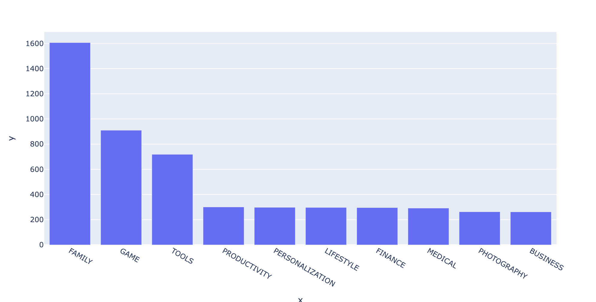
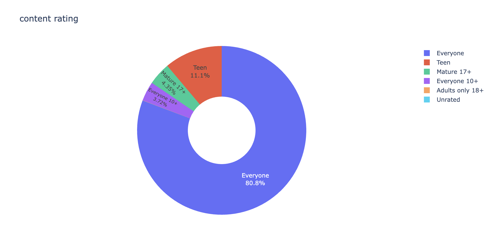

# 📱 Google Play Store App Analytics

This project explores the **Google Play Store app dataset** to identify trends, outliers, and factors that might influence app success. The analysis is done using Python in Jupyter Notebook and includes data cleaning, visualization, and interpretation of patterns based on app ratings, categories, installs, reviews, and pricing.

Through this analysis, we tried to answer questions like:

* Which categories dominate the Play Store?
* Do paid apps perform better than free apps?
* What’s the relationship between installs, ratings, and reviews?
* Are larger apps better rated?
* How are apps distributed across genres?

---

### 1. **App Categories and Their Count**

We found that the **FAMILY** category has the highest number of apps, followed by **GAME** and **TOOLS**.

---

### 2. **Content Ratings**

The chart shows that over 80% of apps on the Play Store are rated “Everyone”, indicating a strong focus on universally accessible content. “Teen” and “Mature 17+” apps follow but make up a much smaller share. This suggests developers prioritize broad user reach and compliance with Google’s age policies.

### 3. How does the median number of installations compare?

---

### 4. **Free vs Paid Apps**

Free apps overwhelmingly dominate the store, but **paid apps tend to have slightly better average ratings** — possibly due to better content or fewer ads.

---

### 4. **Revenue vs Category**

The apps in the Game, Family and Business has the highest revenue.

---

### 6. **Price per category**

---

### Key Takeaways

* **Free apps dominate**, but ratings don’t suffer compared to paid ones.
* **High installs** correlate with more reviews, but not necessarily with higher ratings.
* **Certain categories** consistently perform better (Books, Education).
* **Data cleaning is critical** in app datasets due to inconsistencies in formats (e.g., "1,000+" installs, "\$4.99" price, etc.)

---

### Dataset Source

Most likely from Kaggle:
[Google Play Store Apps Dataset](https://www.kaggle.com/datasets/lava18/google-play-store-apps)

