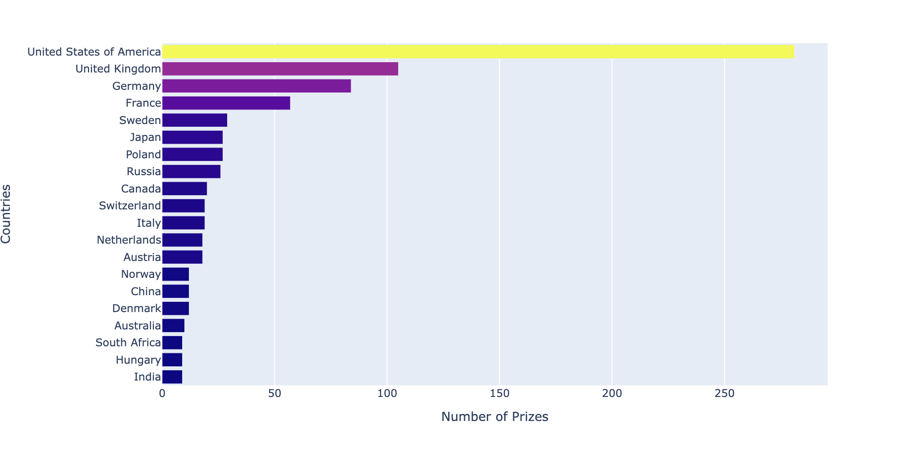

# Nobel Prize Data Analysis

This project analyzes trends and patterns in Nobel Prize awards from 1901 to recent years. The goal was to explore **who wins Nobel Prizes**, **in which fields**, and whether there are any disparities based on **gender, country, or age**. All the analysis was done in the Jupyter notebook: `Nobel_Prize_Analysis.ipynb`.

---
##  Summary of What’s Inside

The notebook goes through:

1. **Data Cleaning**

   * Converted date columns to proper datetime formats
   * Dealt with missing values (especially in birth dates or affiliations)
   * Extracted useful columns like `decade`, `age at award`, and `country`

2. **Exploratory Data Analysis (EDA)**
   We looked at:

   * Number of prizes per category and per year
   * Distribution of male vs. female laureates
   * Countries that produced the most Nobel winners
   * Age at the time of winning the award
   * Trends over time (are things getting more inclusive?)

3. **Visualizations**
   Matplotlib and Seaborn were used for static plots, mostly bar plots, line plots, and box plots.

##  Key Findings 

### Percentage of Male vs. Female Laureates

### Number of Prizes per Category

### Number of prize awarded over time

---

## Where do discoveries takes place?
<video controls src="Screen Recording 2024-06-18 at 11.36.15 AM.mov" title="Title"></video>

### 1. Physics, Chemistry, and Medicine dominate

Most prizes were awarded in these categories, especially in the early decades.
**Plot to include:** Bar plot of number of prizes per category.

### 2. Gender gap is huge, especially in STEM fields

There are significantly fewer female Nobel laureates overall, and almost none in Physics and Economics until recent years.
**Plot to include:** Line plot of number of male vs. female laureates over time, broken down by category.

**Insight:** This suggests a historic lack of recognition for women in science, likely due to structural and social barriers.

### 3. USA dominates in Nobel wins post-WWII

From 1950s onward, the U.S. shows a steep rise in Nobel laureates, particularly in Physics, Medicine, and Economics.
**Plot to include:** Line plot of top 5 countries with most Nobel winners by decade.

**Reasoning:** Likely due to increased research funding, university dominance (e.g., MIT, Harvard), and post-war migration of scientists.

### 4. Average age of winners is increasing

On average, Nobel winners are getting older, especially in categories like Physics and Medicine.
**Plot to include:** Line or box plot of age at time of award by decade.

**Insight:** Scientific recognition may be taking longer due to increasing complexity and competition in research.

### 5. Peace prize trends show political influence

Peace prizes often reflect geopolitical contexts — spikes in awards during or after major global events (e.g., world wars, cold war).
**Plot to include:** Timeline of Peace Prize winners with notable global events annotated.

---

## 📁 How to Use

1. Clone this repo or download the `.ipynb` file.
2. Make sure you have Python and Jupyter installed.
3. Open the notebook and run it cell by cell.
4. You’ll see visualizations inline and can tweak code to dig deeper.

---
